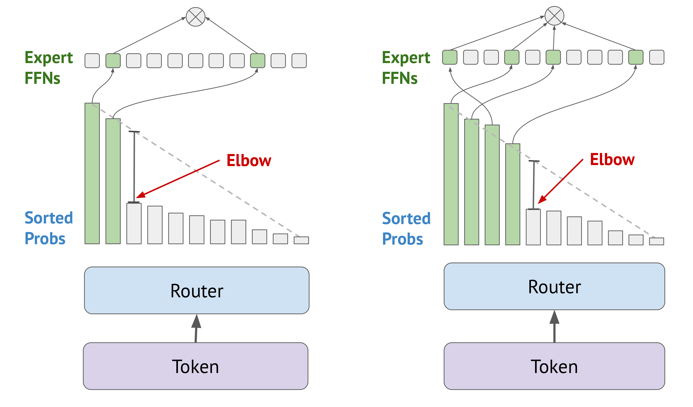

# Elbow-Based MoE Routing: A Training Free Inference Time Plugin for Expert Selection

Elbow-based routing is a training-free inference-time modification for Mixture of Experts (MoE) models that dynamically adjusts the number of active experts on a per-token basis based on the "elbow" of the sorted router probability curve.

## Environment

`mamba env create -f env/environment.yml -n [env name]`

`mamba activate [env name]`

In case of compatibility issues with datasets (e.g. PIQA), use `env/environment-py312.yml`.

## Project Structure

- `notebooks/` - Plotting and analysis
  - `elbowanalysis.ipynb` - Analyze patterns in router elbows
  - `plot_random_tail_acc.py` - Plotting for tail randomization experiment
  - `plottingevals.ipynb` - Plotting and data analysis for performance benchmarking
- `scripts/` - Implementation of elbow and benchmarking
  - `evals.py` - Accuracy, FLOPs, mean-k + elbow-based routing implementation
  - `latency.py` - Latency + elbow-based routing implementation
  - `randomize_tail_experts.py` - Tail randomization experiment

## Quick start

`python latency.py --method elbow --benchmark [benchmark dataset]`

`python evals.py --method elbow --benchmark [benchmark dataset]`
