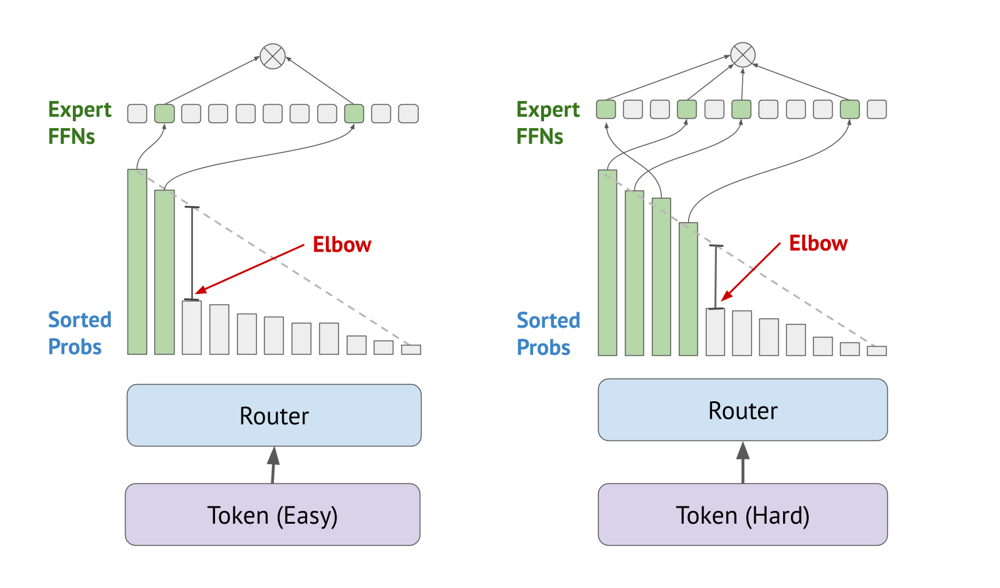

# Elbow-Based MoE Routing: A Training Free Inference Time Plugin for Expert Selection

Elbow-Based routing is training-free inference-time modification for mixture of expert (MoE) models that dynamically adjusts the number of experts on a per-token basis based on the "elbow" of the sorted router probability curve. 

## Environment
Python==3.12
pip install -q torch torchvision transformers pandas numpy accelerate bitsandbytes datasets

## Project Structure

- `Notebooks` - Plotting and analysis
  - `elbowanalysis.ipynb` - Analyze patterns in router elbows
  - `plot_random_tail_acc.py` - Plotting for tail randomization experiment
  - `plottingevals.ipynb` - Plotting and data analysis for performance benchmarking
- `scripts/` - Implementation of elbow and benchmarking
  - evals.py - Accuracy, FLOPs, mean-k + elbow-based routing implementation
  - latency.py - Latency + elbow-based routing implementation
  - randomize_tail_experts.py - Tail randomization experiment

## Quick start

For latency evaluation: 

python latency.py --method elbow --benchmark [benchmark dataset]

python evals.py --method elbow --benchmkar [benchmark dataset]
